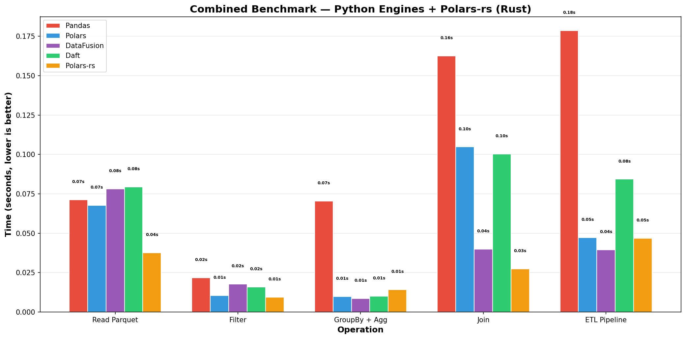
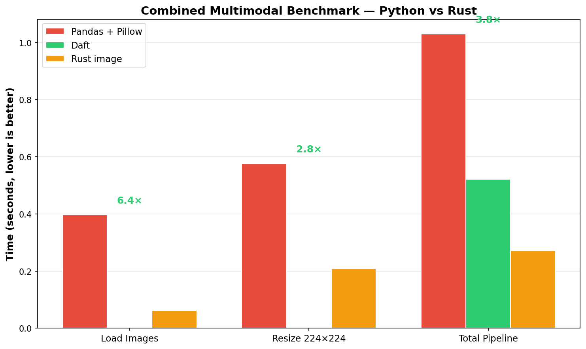

# Engine Comparison Demo

**Companion repository for the published article: [Benchmarking Modern Data Processing Engines](https://slavadubrov.github.io/blog/2026/02/21/benchmarking-modern-data-processing-engines/).**

This repository provides hands-on benchmarking and exploration of modern DataFrame engines — Pandas, Polars, DataFusion, Daft, and native Rust implementations. No synthetic data. No toy examples. Real NYC taxi trips and real food photos.

---

## What's Inside

This repo has **two parts**:

### Part 1: Benchmarking Scripts

Run reproducible benchmarks yourself and compare results on your own hardware:

- **Python packages** — Pandas, Polars, DataFusion, Daft
- **Native Rust scripts** — Polars-rs and `image` crate for raw performance comparison

See [Benchmark Results](#benchmark-results) for our latest run.

### Part 2: Interactive Notebooks

Explore different DataFrame engines with ready-to-run examples:

- [`engine_comparison_examples.ipynb`](notebook/engine_comparison_examples.ipynb) — Side-by-side examples of Pandas, Polars, DataFusion, and Daft APIs
- [`distributed_spark.ipynb`](notebook/distributed_spark.ipynb) — PySpark tabular ETL
- [`distributed_ray.ipynb`](notebook/distributed_ray.ipynb) — Ray Data GPU image classification
- [`distributed_daft.ipynb`](notebook/distributed_daft.ipynb) — Daft multimodal pipeline with CLIP embeddings

You can also spin up distributed services via Docker Compose to test cluster-scale patterns locally.

---

## Benchmark Results

Combined results from Python engines and native Rust benchmarks on ~41M NYC taxi trips and 500 food images.

### Tabular Benchmark (Python + Rust)



| Operation | Pandas | Polars | DataFusion | Daft | Polars-rs (Rust) |
|---|---|---|---|---|---|
| Read Parquet | 0.65s | 1.34s | 0.53s | 0.92s | **0.42s** |
| Filter | 0.50s | 0.15s | 0.18s | 0.17s | **0.09s** |
| GroupBy + Agg | 0.92s | **0.07s** | 0.08s | 0.08s | 0.19s |
| Join | 2.08s | 1.94s | **1.21s** | 2.42s | 1.73s |
| ETL Pipeline | 4.64s | 0.71s | **0.48s** | 1.10s | 0.57s |

### Multimodal Benchmark (Python + Rust)



| Operation | Pandas + Pillow | Daft | Rust `image` | Speedup |
|---|---|---|---|---|
| Load Images | 0.40s | — | **0.07s** | 5.7× |
| Resize 224×224 | 0.58s | — | **0.26s** | 2.2× |
| Total Pipeline | 1.03s | **0.30s** | 0.33s | 3.1× |

> Polars and DataFusion are excluded from multimodal because they lack native image operations — image work would still go through sequential Python.

---

## Quick Start

```bash
# 1. Install uv (if you don't have it)
curl -LsSf https://astral.sh/uv/install.sh | sh

# 2. Sync dependencies
uv sync

# 3. Pre-download datasets (optional — benchmarks auto-download on first run)
uv run python -m engine_comparison.data.loader

# 4. Run the tabular benchmark (~41M NYC taxi trips)
uv run python -m engine_comparison.benchmarks.tabular

# 5. Run the multimodal benchmark (500 real food photos)
uv run python -m engine_comparison.benchmarks.multimodal
```

First run downloads ~660 MB of data. Subsequent runs use the cache in `.data/`.

---

## Full Benchmark Pipeline (Python + Rust)

Run both Python and native Rust benchmarks, then aggregate results into combined charts:

```bash
# Run the complete pipeline
./scripts/run_benchmarks.sh
```

This executes:

1. **Python tabular** → `benchmarks/tabular_results.json`
2. **Python multimodal** → `benchmarks/multimodal_results.json`
3. **Rust benchmarks** (Polars-rs + image) → `benchmarks/rust_*.json`
4. **Aggregator** → `benchmarks/combined_*.png`

### Rust Requirements

The Rust benchmark requires the Rust toolchain:

```bash
# Install Rust (if needed)
curl --proto '=https' --tlsv1.2 -sSf https://sh.rustup.rs | sh

# Build the Rust benchmark (first run compiles dependencies)
cd rust_benchmark && cargo build --release && cd ..
```

### Individual Rust Benchmark

```bash
# Run Rust benchmarks standalone (after Python benchmarks to ensure data exists)
cd rust_benchmark && cargo run --release && cd ..
```

### Aggregate Results Only

```bash
# Re-aggregate existing JSON files into charts
uv run python -m engine_comparison.benchmarks.aggregate
```

---

## CLI Options

```bash
# Tabular: change data month
uv run python -m engine_comparison.benchmarks.tabular --year 2023 --month 6

# Tabular: more timing precision
uv run python -m engine_comparison.benchmarks.tabular --runs 5

# Multimodal: more images = larger speedup (more parallelism)
uv run python -m engine_comparison.benchmarks.multimodal --images 1000

# Multimodal: quick smoke test
uv run python -m engine_comparison.benchmarks.multimodal --images 100
```

---

## Datasets

### Tabular: NYC Yellow Taxi Trip Records

| Attribute | Value |
|---|---|
| Source | [NYC Taxi & Limousine Commission](https://www.nyc.gov/site/tlc/about/tlc-trip-record-data.page) |
| Format | Apache Parquet |
| Default | 2024 Full Year (~41M rows × 19 columns, ~660 MB) |
| Join table | Taxi Zone Lookup (265 zones with borough names) |

Real taxi trip records: pickup/dropoff times, locations, distances, fares,
tips, payment types. The join table maps numeric location IDs to human-readable
borough and zone names (e.g., "Manhattan — Upper East Side North").

### Multimodal: Food-101 (ETH Zurich)

| Attribute | Value |
|---|---|
| Source | [ETH Zurich via Hugging Face](https://huggingface.co/datasets/ethz/food101) |
| Format | JPEG images |
| Default | 500 images (configurable) |
| Content | Real food photos — pizza, sushi, steak, etc. |

Real photographs of food in 101 categories. Variable sizes and aspect ratios,
exactly like production ML preprocessing pipelines encounter.

---

## What's Benchmarked

### Tabular Operations (`tabular.py`)

| Operation | What it tests | Real-world analogy |
|---|---|---|
| Read Parquet | Full scan of ~660 MB file | Loading a dataset for analysis |
| Filter | `distance > 5mi AND fare > $30` | Finding high-value trips |
| GroupBy + Agg | Revenue by payment type | Payment analytics dashboard |
| Join | Trip data ⟕ Zone lookup | Enriching with borough names |
| ETL Pipeline | Filter → Join → Aggregate → Sort | Building a revenue report |

Engines: **Pandas** · **Polars** · **DataFusion** · **Daft** · **Polars-rs (Rust)**

### Image Processing (`multimodal.py`)

| Operation | What it tests | Real-world analogy |
|---|---|---|
| Load Images | Read + decode JPEGs | ML data pipeline ingestion |
| Resize 224×224 | Resize to model input size | Preprocessing for ResNet/ViT |
| Total Pipeline | Load → Decode → Resize | End-to-end ML preprocessing |

Engines: **Pandas + Pillow** (sequential) vs. **Daft** (parallel Rust) vs. **Rust `image`** (native)

---

## Interactive Notebooks

### Local Examples

The [`engine_comparison_examples.ipynb`](notebook/engine_comparison_examples.ipynb) notebook contains side-by-side examples of:

- Reading and writing Parquet files
- Filtering, aggregation, and joins
- ETL pipelines
- API comparisons between Pandas, Polars, DataFusion, and Daft

### Distributed Notebooks (Docker Compose)

Three Jupyter notebooks let you explore distributed engines interactively:

| Notebook | Engine | Workload |
|----------|--------|----------|
| `distributed_spark.ipynb` | PySpark | Tabular ETL — filter, join, aggregate, window functions |
| `distributed_ray.ipynb` | Ray Data | GPU image classification with ActorPoolStrategy |
| `distributed_daft.ipynb` | Daft | Multimodal pipeline — Rust I/O, CLIP embedding, Arrow interop |

#### Quick Start (Docker)

```bash
# 1. Build images (includes Hadoop AWS + AWS SDK v2 for S3A support)
docker compose build

# 2. Start services (example for PySpark — use ray-head for Ray/Daft)
docker compose up -d minio minio-setup spark-master
docker compose up -d --scale spark-worker=1 spark-worker app

# 3. Upload sample data to MinIO
./scripts/upload-data.sh

# 4. Launch Jupyter Lab
docker compose exec app jupyter lab --ip 0.0.0.0 --port 8888 --allow-root --no-browser --notebook-dir=/app/notebook
```

Open <http://localhost:8888> and select a notebook. Each notebook includes setup instructions for its specific services.

> **Note:** The first `docker compose build` downloads Hadoop AWS (3.4.0) and AWS SDK v2 JARs required for Spark S3A connectivity to MinIO. This is a one-time step.

---

## Docker Compose (Distributed Stack)

Run the distributed pipelines locally using Docker Compose with GPU support.

### Prerequisites

- **Docker** 20.10+ with Compose v2
- **NVIDIA Docker** (for GPU support) — [Installation Guide](https://docs.nvidia.com/datacenter/cloud-native/container-toolkit/install-guide.html)
- **~32 GB RAM** recommended (24 GB for Ray + 8 GB for app container)
- **Single GPU** (RTX 4090, etc.) — config is optimized for single-GPU setups

### S3A Connectivity (Spark + MinIO)

Spark 4.1.1 requires **Hadoop 3.4.0** with **AWS SDK v2** for S3A filesystem support. The Dockerfile automatically downloads:

- `hadoop-aws-3.4.0.jar` — S3A filesystem implementation
- `bundle-2.20.160.jar` — AWS SDK v2 (required by Hadoop 3.4.x)

These JARs enable Spark to read from MinIO using `s3a://` URIs. The configuration is pre-set in docker-compose.yml:

```yaml
environment:
  - SPARK_MASTER=spark://spark-master:7077
  - AWS_ENDPOINT_URL=http://minio:9000
  - AWS_ACCESS_KEY_ID=minioadmin
  - AWS_SECRET_ACCESS_KEY=minioadmin
```

No additional configuration is needed — just run `docker compose build` once.

### Quick Start (Single GPU)

For local development on a single GPU, start only the services needed for each pipeline:

```bash
# 1. Build all images
docker compose build
```

**For Daft/Ray pipelines:**

```bash
# Start minimal stack (MinIO + Ray + App container)
docker compose up -d minio minio-setup ray-head app

# Upload sample data
./scripts/upload-data.sh

# Run Daft pipeline
./scripts/docker-run-daft.sh --input s3://bucket/image_metadata.parquet --output s3://bucket/embeddings/

# Run Ray inference
./scripts/docker-run-ray.sh --input s3://bucket/images/ --output s3://bucket/predictions/
```

**For Spark pipelines:**

```bash
# Start Spark stack (MinIO + Spark)
docker compose up -d minio minio-setup spark-master
docker compose up -d --scale spark-worker=1 spark-worker app

# Run Spark ETL
./scripts/docker-run-spark.sh --orders "s3a://lake/taxi/*.parquet" --output s3a://warehouse/report
```

> **Important:** Don't run `docker compose up -d` without specifying services — this starts ALL containers and causes GPU memory contention.

### Resource Configuration (Single GPU)

The docker-compose.yml is optimized for single-GPU setups:

| Service | GPU | Memory | Default State |
|---------|-----|--------|---------------|
| ray-head | 1 GPU | 24 GB | Enabled |
| ray-worker | — | — | Disabled (replicas=0) |
| spark-worker | 1 GPU | 10 GB | Disabled (replicas=0) |
| app | — | 8 GB | Enabled (Ray client) |

**To scale Spark workers:**

```bash
docker compose up -d --scale spark-worker=1 spark-worker
```

**To stop GPU-heavy services:**

```bash
docker compose stop ray-head spark-worker
```

### Web UIs

| Service | URL | Description |
|---------|-----|-------------|
| MinIO Console | <http://localhost:9001> | S3 browser (login: `minioadmin` / `minioadmin`) |
| Spark UI | <http://localhost:8080> | Spark master dashboard |
| Ray Dashboard | <http://localhost:8265> | Ray cluster status |

### Stopping

```bash
docker compose down          # Stop services
docker compose down -v       # Stop and remove volumes (clears MinIO data)
```

### Troubleshooting

| Issue | Solution |
|-------|----------|
| System freeze / unresponsive | Too many GPU containers. Stop all: `docker compose down`, then start only needed services |
| `FileNotFoundError` or missing data | Run `./scripts/upload-data.sh` first |
| GPU out of memory | Stop other GPU containers: `docker compose stop spark-worker` |
| Ray "No healthy driver" error | Ensure ray-head is running: `docker compose up -d ray-head` |
| Slow performance | Run one pipeline at a time; don't mix Spark + Ray simultaneously |
| Daft "bucket not found" error | Ensure MinIO setup completed (`docker compose logs minio-setup`) |
| Spark S3A `ClassNotFoundException` | Rebuild images: `docker compose build` (downloads Hadoop AWS JARs) |
| Spark S3A `NumberFormatException: "60s"` | Hadoop version mismatch. Dockerfile uses Hadoop 3.4.0 matching Spark 4.1.1 |
| Spark S3A `AwsCredentialsProvider` error | AWS SDK v2 required. Dockerfile includes `bundle-2.20.160.jar` |

---

## Distributed Scripts (Cluster Required)

The `src/engine_comparison/distributed/` directory contains reference
implementations for cluster-scale processing:

| Module | Engine | Workload |
|---|---|---|
| `ray_inference` | Ray Data | GPU batch image classification |
| `daft_pipeline` | Daft Flotilla | Distributed document embedding |
| `spark_etl` | PySpark | Petabyte-scale tabular ETL |

Install extras: `uv sync --extra distributed`

These require actual cluster infrastructure (Ray, Spark, or Daft Cloud).

---

## Requirements

- **Python** 3.10 – 3.12
- **uv** (recommended) or pip
- **~8 GB free RAM** for the tabular benchmark
- **Internet** on first run (downloads ~660 MB total, then cached)
- Works on **macOS**, **Linux**, and **Windows**

---

## Project Structure

```
engine-comparison-demo/
├── pyproject.toml                      # uv/pip project config
├── Dockerfile                          # GPU-enabled Python container
├── docker-compose.yml                  # Spark, Ray, MinIO stack
├── scripts/
│   ├── run_benchmarks.sh               # Full pipeline orchestration
│   ├── docker-run-spark.sh             # Run Spark ETL
│   ├── docker-run-ray.sh               # Run Ray inference
│   ├── docker-run-daft.sh              # Run Daft pipeline
│   └── upload-data.sh                  # Upload to MinIO
├── rust_benchmark/                     # Native Rust benchmarks
│   ├── Cargo.toml                      # Rust dependencies
│   └── src/main.rs                     # Polars-rs + image benchmarks
├── src/engine_comparison/              # Main package
│   ├── __init__.py
│   ├── constants.py                    # Centralized configuration
│   ├── data/
│   │   ├── __init__.py
│   │   └── loader.py                   # Downloads + caches datasets
│   ├── benchmarks/
│   │   ├── __init__.py
│   │   ├── tabular.py                  # NYC Taxi benchmark
│   │   ├── multimodal.py               # Food-101 benchmark
│   │   └── aggregate.py                # Combine Python + Rust results
│   └── distributed/
│       ├── __init__.py
│       ├── ray_inference.py            # Ray Data GPU inference
│       ├── daft_pipeline.py            # Daft distributed embedding
│       └── spark_etl.py                # PySpark ETL
├── notebook/                           # Interactive notebooks
│   ├── engine_comparison_examples.ipynb
│   ├── distributed_spark.ipynb
│   ├── distributed_ray.ipynb
│   └── distributed_daft.ipynb
├── benchmarks/                         # Benchmark outputs
│   ├── *.json                          # JSON reports
│   └── *.png                           # Charts
└── .data/                              # Auto-created cache (gitignored)
    ├── yellow_tripdata.parquet
    ├── taxi_zone_lookup.csv
    └── food101_images/
```

---

## License

MIT
