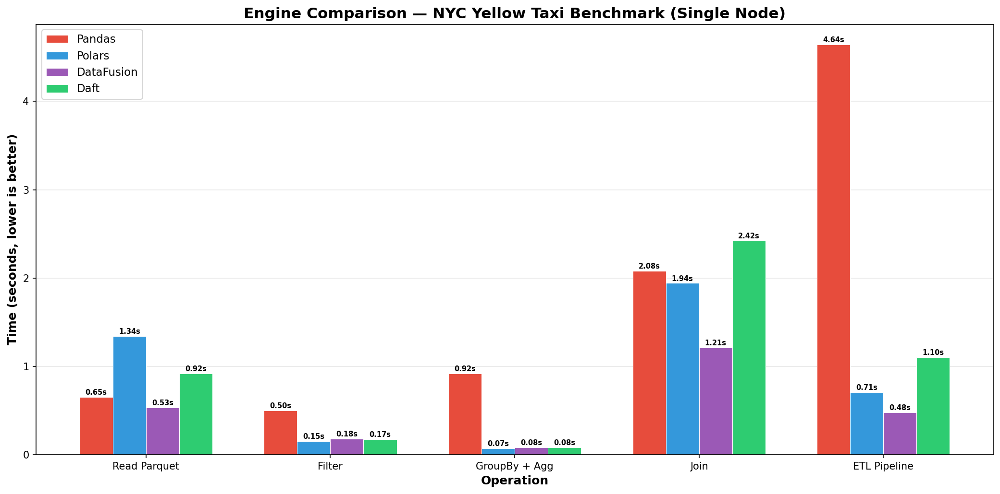
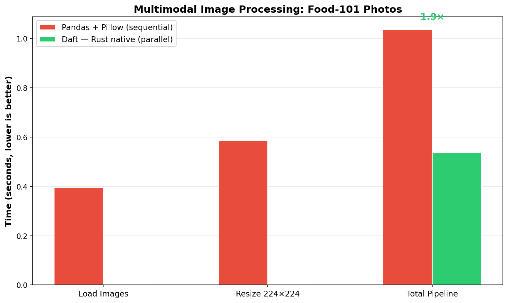

# The Engine Wars — Live Demo

**Benchmark Pandas vs. Polars vs. DataFusion vs. Daft on real-world datasets.**

No synthetic data. No toy examples. Real NYC taxi trips and real food photos.

---

## Quick Start

```bash
# 1. Install uv (if you don't have it)
curl -LsSf https://astral.sh/uv/install.sh | sh

# 2. Sync dependencies
uv sync

# 3. Pre-download datasets (optional — benchmarks auto-download on first run)
uv run python -m engine_comparison.data.loader

# 4. Run the tabular benchmark (~2.9M NYC taxi trips)
uv run python -m engine_comparison.benchmarks.tabular

# 5. Run the multimodal benchmark (5000 real food photos)
uv run python -m engine_comparison.benchmarks.multimodal
```

First run downloads ~50 MB of data. Subsequent runs use the cache in `.data/`.

---

## Datasets

### Tabular: NYC Yellow Taxi Trip Records

| Attribute | Value |
|---|---|
| Source | [NYC Taxi & Limousine Commission](https://www.nyc.gov/site/tlc/about/tlc-trip-record-data.page) |
| Format | Apache Parquet |
| Default | January 2024 (~2.9M rows × 19 columns, ~45 MB) |
| Join table | Taxi Zone Lookup (265 zones with borough names) |

Real taxi trip records: pickup/dropoff times, locations, distances, fares,
tips, payment types. The join table maps numeric location IDs to human-readable
borough and zone names (e.g., "Manhattan — Upper East Side North").

### Multimodal: Food-101 (ETH Zurich)

| Attribute | Value |
|---|---|
| Source | [ETH Zurich via Hugging Face](https://huggingface.co/datasets/ethz/food101) |
| Format | JPEG images |
| Default | 5000 images (configurable) |
| Content | Real food photos — pizza, sushi, steak, etc. |

Real photographs of food in 101 categories. Variable sizes and aspect ratios,
exactly like production ML preprocessing pipelines encounter.

---

## What's Benchmarked

### `bench_tabular.py` — Tabular Operations

| Operation | What it tests | Real-world analogy |
|---|---|---|
| Read Parquet | Full scan of ~45 MB file | Loading a dataset for analysis |
| Filter | `distance > 5mi AND fare > $30` | Finding high-value trips |
| GroupBy + Agg | Revenue by payment type | Payment analytics dashboard |
| Join | Trip data ⟕ Zone lookup | Enriching with borough names |
| ETL Pipeline | Filter → Join → Aggregate → Sort | Building a revenue report |

Engines: **Pandas** · **Polars** · **DataFusion** · **Daft**

### `bench_multimodal.py` — Image Processing

| Operation | What it tests | Real-world analogy |
|---|---|---|
| Load Images | Read + decode JPEGs | ML data pipeline ingestion |
| Resize 224×224 | Resize to model input size | Preprocessing for ResNet/ViT |
| Total Pipeline | Load → Decode → Resize | End-to-end ML preprocessing |

Engines: **Pandas + Pillow** (sequential) vs. **Daft** (parallel Rust)

> Polars and DataFusion are excluded from the multimodal benchmark because
> they lack native image operations — image work would still go through
> sequential Python.

---

## CLI Options

```bash
# Tabular: change data month
uv run python -m engine_comparison.benchmarks.tabular --year 2023 --month 6

# Tabular: more timing precision
uv run python -m engine_comparison.benchmarks.tabular --runs 5

# Multimodal: more images = larger speedup (more parallelism)
uv run python -m engine_comparison.benchmarks.multimodal --images 1000

# Multimodal: quick smoke test
uv run python -m engine_comparison.benchmarks.multimodal --images 100
```

---

## Docker Compose (Distributed Stack)

Run the distributed pipelines locally using Docker Compose with GPU support.

### Prerequisites

- **Docker** 20.10+ with Compose v2
- **NVIDIA Docker** (for GPU support) — [Installation Guide](https://docs.nvidia.com/datacenter/cloud-native/container-toolkit/install-guide.html)
- **~16 GB RAM** recommended for full stack

### Quick Start

```bash
# 1. Build all images
docker compose build

# 2. Start the distributed stack
docker compose up -d

# 3. Check services
docker compose ps
```

### Web UIs

| Service | URL | Description |
|---------|-----|-------------|
| MinIO Console | http://localhost:9001 | S3 browser (login: `minioadmin` / `minioadmin`) |
| Spark UI | http://localhost:8080 | Spark master dashboard |
| Ray Dashboard | http://localhost:8265 | Ray cluster status |

### Running Pipelines

```bash
# Spark ETL (NYC Taxi)
./scripts/docker-run-spark.sh --orders s3a://lake/taxi/*.parquet --output s3a://warehouse/report/

# Ray inference (GPU image classification)
./scripts/docker-run-ray.sh --input s3://bucket/images/ --output s3://bucket/predictions/

# Daft pipeline (document embedding)
./scripts/docker-run-daft.sh --input s3://lake/pdfs.parquet --output s3://output/embeddings/
```

### Uploading Test Data

```bash
# Upload local files to MinIO
./scripts/upload-data.sh .data/food101 bucket/images/
```

### Stopping

```bash
docker compose down          # Stop services
docker compose down -v       # Stop and remove volumes (clears MinIO data)
```

---

## Distributed Scripts (Cluster Required)

The `src/engine_comparison/distributed/` directory contains reference
implementations for cluster-scale processing:

| Module | Engine | Workload |
|---|---|---|
| `ray_inference` | Ray Data | GPU batch image classification |
| `daft_pipeline` | Daft Flotilla | Distributed document embedding |
| `spark_etl` | PySpark | Petabyte-scale tabular ETL |

Install extras: `uv sync --extra distributed`

These require actual cluster infrastructure (Ray, Spark, or Daft Cloud).

---

## Expected Output

### Tabular benchmark

```
⚡ Engine Wars — NYC Taxi Benchmark Results
┏━━━━━━━━━━━━━━━━━━┳━━━━━━━━━━━━━━━━━━┳━━━━━━━━━━━━━━━━━━┳━━━━━━━━━━━━━━━━━━┳━━━━━━━━━━━━━━━━━━┓
┃ Operation        ┃           Pandas ┃           Polars ┃       DataFusion ┃             Daft ┃
┡━━━━━━━━━━━━━━━━━━╇━━━━━━━━━━━━━━━━━━╇━━━━━━━━━━━━━━━━━━╇━━━━━━━━━━━━━━━━━━╇━━━━━━━━━━━━━━━━━━┩
│ Read Parquet     │           0.062s │      0.062s 1.0× │      0.073s 0.8× │      0.067s 0.9× │
├──────────────────┼──────────────────┼──────────────────┼──────────────────┼──────────────────┤
│ Filter           │           0.016s │      0.024s 0.7× │      0.059s 0.3× │      0.083s 0.2× │
├──────────────────┼──────────────────┼──────────────────┼──────────────────┼──────────────────┤
│ GroupBy + Agg    │           0.068s │      0.019s 3.7× │      0.023s 3.0× │      0.023s 3.0× │
├──────────────────┼──────────────────┼──────────────────┼──────────────────┼──────────────────┤
│ Join             │           0.121s │      0.098s 1.2× │      0.164s 0.7× │      0.141s 0.9× │
├──────────────────┼──────────────────┼──────────────────┼──────────────────┼──────────────────┤
│ ETL Pipeline     │           0.153s │      0.039s 4.0× │      0.038s 4.0× │      0.070s 2.2× │
├──────────────────┼──────────────────┼──────────────────┼──────────────────┼──────────────────┤
│ Total            │            0.42s │       0.24s 1.7× │       0.36s 1.2× │       0.38s 1.1× │
└──────────────────┴──────────────────┴──────────────────┴──────────────────┴──────────────────┘
```

*(Results from a 10-core Mac — your numbers will vary by hardware.)*



### Multimodal benchmark

```
🖼  Engine Wars — Food-101 Multimodal Benchmark
┏━━━━━━━━━━━━━━━━━━━━┳━━━━━━━━━━━━━━━━━━━━┳━━━━━━━━━━━━━━━━━━━━┳━━━━━━━━━━━━┓
┃ Operation          ┃    Pandas + Pillow ┃        Daft (Rust) ┃    Speedup ┃
┡━━━━━━━━━━━━━━━━━━━━╇━━━━━━━━━━━━━━━━━━━━╇━━━━━━━━━━━━━━━━━━━━╇━━━━━━━━━━━━┩
│ Load Images        │             3.840s │             3.863s │       1.0× │
├────────────────────┼────────────────────┼────────────────────┼────────────┤
│ Resize 224×224     │             5.775s │             3.321s │       1.7× │
├────────────────────┼────────────────────┼────────────────────┼────────────┤
│ Total Pipeline     │            10.980s │             3.832s │       2.9× │
└────────────────────┴────────────────────┴────────────────────┴────────────┘
```



Saves `multimodal_results.png` — a comparison chart.

---

## Requirements

- **Python** 3.10 – 3.12
- **uv** (recommended) or pip
- **~2 GB free RAM** for the tabular benchmark
- **Internet** on first run (downloads ~50 MB total, then cached)
- Works on **macOS**, **Linux**, and **Windows**

---

## Project Structure

```
engine-comparison-demo/
├── pyproject.toml                      # uv/pip project config
├── Dockerfile                          # GPU-enabled Python container
├── docker-compose.yml                  # Spark, Ray, MinIO stack
├── scripts/
│   ├── docker-run-spark.sh             # Run Spark ETL
│   ├── docker-run-ray.sh               # Run Ray inference
│   ├── docker-run-daft.sh              # Run Daft pipeline
│   └── upload-data.sh                  # Upload to MinIO
├── src/engine_comparison/              # Main package
│   ├── __init__.py
│   ├── constants.py                    # Centralized configuration
│   ├── data/
│   │   ├── __init__.py
│   │   └── loader.py                   # Downloads + caches datasets
│   ├── benchmarks/
│   │   ├── __init__.py
│   │   ├── tabular.py                  # NYC Taxi benchmark
│   │   └── multimodal.py               # Food-101 benchmark
│   └── distributed/
│       ├── __init__.py
│       ├── ray_inference.py            # Ray Data GPU inference
│       ├── daft_pipeline.py            # Daft distributed embedding
│       └── spark_etl.py                # PySpark ETL
└── .data/                              # Auto-created cache (gitignored)
    ├── nyc_taxi/
    │   ├── yellow_tripdata_2024-01.parquet
    │   └── taxi_zone_lookup.csv
    └── food101/
        └── food_00000.jpg ... food_04999.jpg
```
