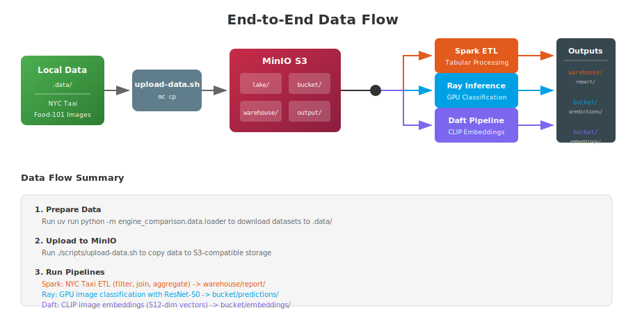
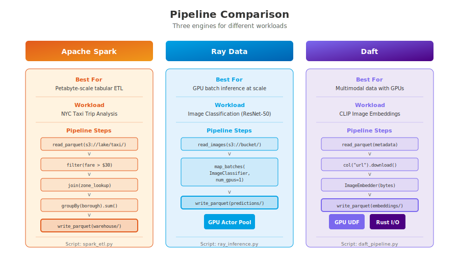

# Architecture Overview

This document explains the distributed computing stack used in the Engine Comparison Demo.

## Overview

The demo compares three distributed data processing engines:

| Engine | Workload | Strength |
|--------|----------|----------|
| **Apache Spark** | Tabular ETL | Petabyte-scale SQL and DataFrame operations |
| **Ray Data** | GPU Inference | Streaming batch inference with actor pools |
| **Daft** | Multimodal | Native GPU UDFs + Rust I/O for images/documents |

All engines read from and write to MinIO (S3-compatible storage), enabling direct comparison on the same datasets.

---

## Services

### MinIO (S3-Compatible Storage)

MinIO provides S3-compatible object storage, acting as the central data lake.

**Ports:**
- `9000` - S3 API (used by all pipelines)
- `9001` - Web Console (browser UI)

**Buckets:**
| Bucket | Purpose |
|--------|---------|
| `lake` | Raw input data (NYC Taxi parquet files) |
| `bucket` | Images and image metadata |
| `warehouse` | Spark ETL output |
| `output` | General pipeline outputs |

**Credentials:** `minioadmin` / `minioadmin`

### Apache Spark Cluster

Classic master-worker architecture for distributed tabular processing.

- **spark-master**: Coordinates job scheduling, exposes Web UI on `:8080`
- **spark-worker** (x2): Execute tasks, GPU-enabled for ML workloads

Spark excels at SQL-like operations: filtering, joins, aggregations over massive datasets.

### Ray Cluster

Actor-based distributed computing optimized for ML workloads.

- **ray-head**: GCS (Global Control Store), dashboard on `:8265`
- **ray-worker**: GPU-enabled worker nodes

Ray Data provides streaming execution with backpressure, ideal for GPU inference where you don't want to OOM by loading all data at once.

### App Container

A GPU-enabled container for running pipelines interactively. Pre-configured with:
- `SPARK_MASTER=spark://spark-master:7077`
- `RAY_ADDRESS=ray://ray-head:10001`
- `DAFT_RUNNER=ray`

---

## Network Topology


All containers share the `engine-comparison` Docker network. Each pipeline connects to MinIO for data I/O and optionally to its respective cluster (Spark or Ray).

Key observations:
- **Single GPU sharing**: All GPU containers access the same physical GPU via NVIDIA Docker runtime
- **Isolated clusters**: Spark and Ray clusters are independent
- **Unified storage**: MinIO is the single source of truth for all data

---

## Data Flow



### Step-by-Step

1. **Download datasets locally**
   ```bash
   uv run python -m engine_comparison.data.loader
   ```
   Downloads NYC Taxi data and Food-101 images to `.data/`

2. **Upload to MinIO**
   ```bash
   ./scripts/upload-data.sh
   ```
   Copies data to S3 buckets via MinIO client (`mc`)

3. **Run pipelines**
   Each pipeline reads from MinIO, processes data, and writes results back:

   | Pipeline | Input | Output |
   |----------|-------|--------|
   | Spark ETL | `s3a://lake/taxi/*.parquet` | `s3a://warehouse/report/` |
   | Ray Inference | `s3://bucket/images/` | `s3://bucket/predictions/` |
   | Daft Embeddings | `s3://bucket/image_metadata.parquet` | `s3://bucket/embeddings/` |

---

## Pipeline Comparison



### Apache Spark — Tabular ETL

**Use case:** Large-scale SQL analytics, data warehousing

**Script:** `src/engine_comparison/distributed/spark_etl.py`

```python
df = spark.read.parquet("s3a://lake/taxi/")
df.filter(col("fare_amount") > 30) \
  .join(zones, on="location_id") \
  .groupBy("borough").agg(sum("total_amount")) \
  .write.parquet("s3a://warehouse/report/")
```

### Ray Data — GPU Inference

**Use case:** Batch inference with expensive models, streaming execution

**Script:** `src/engine_comparison/distributed/ray_inference.py`

```python
ds = ray.data.read_images("s3://bucket/images/")
ds.map_batches(
    ImageClassifier,
    compute=ActorPoolStrategy(size=1),  # Single GPU
    num_gpus=1,
    batch_size=32
).write_parquet("s3://bucket/predictions/")
```

Key features:
- **Actor pools**: Model loaded once per actor, reused across batches
- **Streaming**: Bounded memory, backpressure to avoid OOM
- **Auto GPU detection**: Warns if requested GPUs unavailable

### Daft — Multimodal Processing

**Use case:** Images, documents, embeddings with native GPU support

**Script:** `src/engine_comparison/distributed/daft_pipeline.py`

```python
df = daft.read_parquet("s3://bucket/image_metadata.parquet")
df.with_column("bytes", col("image_url").download()) \
  .with_column("embedding", ImageEmbedder(col("bytes"))) \
  .write_parquet("s3://bucket/embeddings/")
```

Key features:
- **Class UDFs**: Model loaded once per worker via `@daft.cls`
- **Rust I/O**: `url.download()` uses parallel Rust, not Python requests
- **Streaming**: Swordfish execution engine with bounded memory

---

## Running the Demo

### Prerequisites

- Docker 20.10+ with Compose v2
- NVIDIA Docker runtime (for GPU support)
- ~16 GB RAM recommended

### Quick Start

```bash
# 1. Build images
docker compose build

# 2. Start the stack
docker compose up -d

# 3. Wait for services (~30s)
docker compose ps

# 4. Upload data
./scripts/upload-data.sh

# 5. Run pipelines
./scripts/docker-run-spark.sh
./scripts/docker-run-ray.sh --gpu-workers 1
./scripts/docker-run-daft.sh
```

### Web UIs

| Service | URL |
|---------|-----|
| MinIO Console | http://localhost:9001 |
| Spark UI | http://localhost:8080 |
| Ray Dashboard | http://localhost:8265 |

---

## Single GPU Notes

If you have a single GPU (e.g., RTX 4090):

1. **All containers share the GPU** — NVIDIA Docker exposes the same device to all containers

2. **Default settings are tuned for single GPU:**
   - Ray: `--gpu-workers 1` (default)
   - Daft: `.into_partitions(1)` limits concurrency

3. **Run pipelines sequentially** — Running multiple GPU pipelines simultaneously will time-share the GPU, reducing throughput

4. **Auto-detection**: Ray pipeline now auto-detects available GPUs and adjusts worker count if needed

### WSL2 Users

GPU passthrough works but may have overhead. For best results:
- Close GPU-intensive applications before running
- Use `nvidia-smi` to monitor GPU memory
- Consider reducing batch sizes if OOM occurs

---

## Troubleshooting

| Issue | Solution |
|-------|----------|
| `FileNotFoundError` | Run `./scripts/upload-data.sh` first |
| "No GPUs detected" | Check `nvidia-smi` and NVIDIA Docker installation |
| Spark job hangs | Check `docker compose logs spark-master` for errors |
| MinIO connection refused | Wait for MinIO to start: `docker compose logs minio` |
| Out of memory | Reduce batch sizes or run pipelines sequentially |

### Useful Commands

```bash
# Check all services
docker compose ps

# View logs for specific service
docker compose logs -f ray-head

# Check GPU visibility in container
docker compose exec app nvidia-smi

# Interactive shell in app container
docker compose exec app bash

# Reset everything
docker compose down -v && docker compose up -d
```
